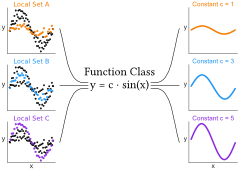

# Function Class Learning with Genetic Programming
This codes aims is to learn the general underlying
pattern by learning a pattern over
multiple related data sets. To do so, we propose a novel approach
to learning an explainable function class, i.e., a set of functions with
the same structure from the combination of all related data
sets. We use symbolic regression to evolve expression trees with
free constants. These constants are learned per data set using
real-valued optimization. Moreover, we present a way to do so in a
unique, multi-modal, multi-objective fashion to find multiple potentially interesting function classes to present to a domain expert
in a single run. 
<p align="center">

</p>
<p align="center">
*Visulisation of the approach.*
</p>

## Related research work
This package represents the code supplement to the paper titled “Function Class Learning with Genetic Programming: Towards
Explainable Meta Learning for Tumor Growth Functionals”,
authored by Evi Sijben, Jeroen Jansen, Tanja Alderliesten and Peter Bosman, which has been published on arxiv. 

If you use our code for academic purposes, please support our research by citing:
```
@article{sijben2024function,
  title={Function Class Learning with Genetic Programming: Towards Explainable Meta Learning for Tumor Growth Functionals},
  author={Sijben, EMC and Jansen, JC and Bosman, PAN and Alderliesten, T},
  journal={arXiv preprint arXiv:2402.12510},
  year={2024}
}
```


## Installation
To install the needed dependencies on ubuntu run `chmod +x deps_ubuntu; sudo ./deps_ubuntu` (or `chmod +x deps_fedora; sudo ./deps_fedora` for fedora). You need to make sure armadillo version > 11.4 is installed. If it is not installed by default, the following steps can be followed:

```
wget https://sourceforge.net/projects/arma/files/armadillo-12.8.2.tar.xz
tar -xf armadillo-12.8.2.tar.xz
cd armadillo-12.8.2
./configure
make
make install
```

The project is built using CMake. Run `make` (or `make debug` for a debug build). If you have `ninja-build` installed, you can use it to speed up builds, by prefixing the make command with `GEN=ninja` (e.g. `GEN=ninja make release`).

## C++ executable
After running `make`, you will find a C++ executable called `main` in `build/release/src/` that you can run using a parameter setting file, for example, `./build/release/src/main --file params/params_gomea_multi_class.txt`.

### Data set structure
Provide the data similar to the file 'data/train/multi_class.dat'. In this, the first column is the data set ID, the last column is the to-be predicted value, and the others are the input data.
The data set ID separates the different local data sets, and all records can thus be kept in one file.
Ensure that the data set IDs start with 1  and that no numbers are skipped (e.g., if n is an ID in the data set, 1 till n-1 should also be an ID), and ensure that the rows are ordered by this ID.
It is possible to provide test data only for a subset of all the local data sets.
Notice that it is necessary to provide both training and validation data for each local data set.

### Results output
Every generation, the solutions on the approximation front are saved to a file 'mo_archive_popsizeX_rvevalsY_plotZ.csv' with X the population size, Y the number of real valued evaluations and Z the generation number. This file is stored in the 'results' folder. 
In case of single-class FC-GOMEA, instead of a 'mo_archive_popsizeX_rvevalsY_plotZ.csv', the final elitist will be save to 'solution_popsizeX_rvevalsY_plotZ.csv'.
These files are all stored in the 'results' folder.

### Constants output and test scores
In order to get the parameters for each of the local data sets, you need to provide the path of the approximation front of which the parameters need to be calculated.
For doing so, make sure the flag resultspath is added to your parameters file with the patht to the results you want to calculate the constants for.
Then run `build/release/src/params`, but make sure to pass the parameter file with the same parameters as when you were running main. It is espacially important to provide the same data for train here, since it effects some of the parameters for real-valued optimization and thus it otherwise might not produce exactly the same constants as when learning the function classes. 
The constants will now be saved to a file called 'constants_fc.csv' and the test scores to a file called 'test_scores.csv'. These files are all stored in the 'results' folder. 
Notice that the test score will only be calculated over the local sets for which you provide test data, but the constants are provided for every local data set. 


## Acknowledgements
This code is an extension to Marco Virgolin's package [GP-GOMEA](https://github.com/marcovirgolin/GP-GOMEA).


